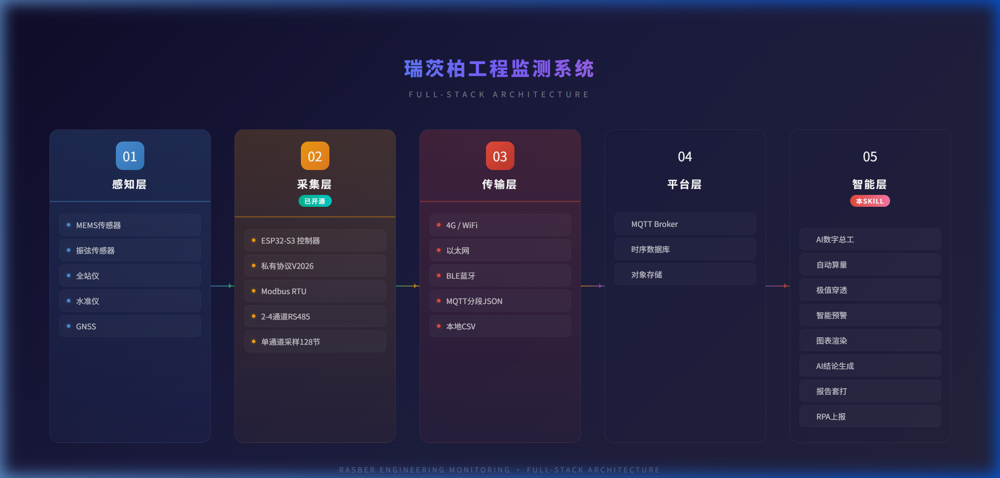

# 🧠 Engineering Monitoring — 工程监测智能报告 Agent

> 国内监测行业首个"开源硬件 + AI 智能软件"全栈式工程监测解决方案

---

## 这是什么？

这是一套专为**工程安全监测行业**设计的 AI Agent 技能指令集（SKILL），配合瑞茨柏已开源的 [ESP32-S3 控制器技术](https://github.com/winterzh/rasber-controller)，打通从"传感器原始数据"到"标准化红头报告"的全链路自动化。

**同时支持自动化监测与人工监测数据的统一接入和融合处理**——无论是仪器自动传的数据，还是现场人员拿水准仪、卷尺手工测量后记在本子上的数据，都能在同一套系统里完成汇总、计算和出报告。

### 一份真实监测日报的"解剖"

以下数据来自某市深基坑项目实际监测日报（xlsm 格式）：

| 指标 | 数值 |
|------|------|
| Excel 工作表数 | **近 50 个**（涵盖10多种监测类型：沉降、轴力、测斜、人工复核、巡视检查……） |
| 嵌入图表数 | **近百张**（沉降时程曲线、测斜包络图、轴力柱状图等） |
| 隐藏公式/中间计算 | **大量**隐藏在独立 Sheet 中的黑盒计算过程，无人敢动 |
| 变量数据 | **上千行 × 数十列**的密集数字海洋 |
| 人工水准测量 | 使用电子水准仪手工采集，另存独立 Sheet（支持各品牌水准仪导出格式） |
| 巡视检查 | 气温、天气、风级、支护结构、施工工况等巡检项，全部手填 |

**这就是全中国绝大多数监测项目每天都在重复的工作。我们的 AI 监测大脑要做的，就是把这几十个 Sheet、近百张图表、大量隐藏公式的工作量，压缩到几秒钟。**

## 系统架构



| 层级 | 说明 | 状态 |
|------|------|------|
| 感知层 | MEMS传感器、振弦传感器、全站仪、水准仪、GNSS | 硬件产品 |
| 感知层（人工） | 手持水准仪、卷尺、裂缝观测仪、现场巡视拍照 | 人工采集 |
| 采集层 | ESP32-S3 控制器、私有协议V2026、Modbus RTU | ⭐ **已开源** |
| 采集层（人工） | 手机App录入、Excel批量导入、纸质记录补录 | 手动输入 |
| 传输层 | 4G/WiFi/以太网、MQTT分段JSON、本地CSV | 通信方案 |
| 平台层 | MQTT Broker、时序数据库、对象存储 | 云平台 |
| 智能层 | AI数字总工：自动算量→极值抓取→预警→图表→报告→RPA上报 | ⭐ **本仓库** |

## 为什么要强调"人工 + 自动化融合"？

在实际监测项目中，**不可能 100% 全自动化**。工地上永远同时存在两类数据源：

| 数据来源 | 典型场景 | 传统处理方式 | 存在的问题 |
|---------|---------|------------|-----------|
| 自动化仪器 | 测斜仪、GNSS、振弦传感器等自动上传 | MQTT/CSV 直接导入 | 格式统一，但与人工数据脱节 |
| 人工水准测量 | 各品牌水准仪逐点量测沉降 | 手抄 - Excel - 手动合并 | 日期错位、基准不咬合 |
| 人工巡视量测 | 卷尺量裂缝宽度、目测渗水量 | 纸质台账 - 事后补录 | 常遗漏、无法追溯 |
| 现场巡视拍照 | 裂缝发展、渗水点、施工工况记录 | 照片存手机 - 手工插入Word | 与数据曲线无关联 |
| 第三方检测报告 | 锚索拉拔试验、混凝土强度检测等 | PDF打印存档 | 无法与时序数据联动 |

**核心痛点：这些数据最后全靠资料员手动"捏合"进一份 Excel，格式不统一、时间对不上，既耗时又容易出错。**

### 我们的融合方案

| 人工数据类型 | 接入方式 | 系统处理 |
|------------|---------|---------|
| 水准仪台账 | 各品牌水准仪 Excel 导出模板一键导入 | 自动匹配测点编号，对齐时间轴，秒级完成解算 |
| 现场量测记录 | 手机 App 拍照 + 表单录入（带 GPS 水印） | 自动归入对应测点与观测期次，与自动化数据同屏展示 |
| 纸质历史台账 | 拍照上传或手动逐条补录 | 断点续传，自动拼接历史基线 |
| 巡视照片 | App 拍照上传（自动标注时间/位置） | 关联到当日日报的"巡视附录"章节，与数据曲线同页呈现 |
| 裂缝/渗水观测 | App 量测模板（宽度mm、长度cm、渗水等级） | 生成裂缝发展趋势图，纳入预警判断体系 |

**最终效果：无论数据怎么来的，在系统里只有一条时间轴、一套统一报表。自动化数据与人工数据浑然一体，报告上的每一个数字都可追溯来源。**

---

## 效率对比

| 环节 | 传统模式 | AI 监测大脑 |
|------|---------|------------|
| 数据录入与计算 | 30~60 分钟 | 自动，0 秒 |
| 人工数据合并对齐 | 20~40 分钟（最易出错） | 自动融合，0 秒 |
| 极值查找与汇总 | 20~30 分钟 | 自动，0.1 秒 |
| 预警比对 | 10~20 分钟（易遗漏） | 自动，零漏报 |
| 图表更新 | 30~40 分钟 | 自动，秒级渲染 |
| 文字结论 | 10~15 分钟（常犯错） | AI 自动生成 |
| 排版打印 | 15~20 分钟 | 一键套打 |
| 多平台填报 | 30~60 分钟 | RPA 自动上报 |
| **合计** | **约 3~5 小时** | **约 3 秒** |

## 核心能力（9大 SKILL）

### 基础能力
1. **⚡ 多源数据融合与去公式化解算** — 自动化+人工数据统一接入，告别 Excel 隐藏公式，零差错
2. **⚡ 全断面极值穿透与多级预警** — 自动抓取最大变化点，五级预警
3. **⚡ 标准化报告自动生成** — AI 结论 + 百级图表秒渲 + 模板套打
4. **⚡ 跨平台 RPA 自动上报** — 千表千面，自动登录住建局平台填报

### 进阶能力
5. **🛡️ 测点生命周期管理** — 测点损坏重埋，基准平移拼接，曲线不断档
6. **🛡️ AI 飞点剔畸** — 时序+空间+物理三重检验，不盲目报警
7. **🛡️ 多模态"数-况-天"融合** — 数据+工况+天气叠印同一图表
8. **🛡️ 全流程溯源日志** — 每笔数据的录入与修正完整留痕，方便追溯
9. **🛡️ 大模型岩土专家语料** — 结论与数据严格绑定，百分百严谨

## 文件说明

| 文件 | 说明 |
|------|------|
| [SKILL.md](SKILL.md) | AI Agent 技能指令集（完整技术文档） |
| [assets/架构流程图.png](assets/架构流程图.png) | 五层系统架构流程图 |
| [示范报告.xlsx](示范报告.xlsx) | AI 数字总工自动生成的 Excel 示范日报（含5个Sheet、预警色标） |

## 快速开始：如何用自己的数据出报告？

### 方式一：AI 对话直接使用（推荐体验）

1. 打开任意支持上传文件的 AI 对话工具（ChatGPT / Claude / Gemini / DeepSeek 等）
2. 将本仓库的 [SKILL.md](SKILL.md) 全文复制粘贴到对话框，作为 AI 的角色指令
3. 上传你的监测 Excel 文件（日报表、水准仪导出表、巡视记录等）
4. 告诉 AI："请按照 SKILL 指令处理这份数据，生成监测日报"
5. AI 将自动完成：数据解算 → 极值穿透 → 预警比对 → 结论生成

> **提示**：可以先下载本仓库的 [示范报告.xlsx](示范报告.xlsx) 看看最终出报告的效果，再用自己的数据试试。

### 方式二：集成到自有平台（API 对接）

将 SKILL.md 作为 System Prompt 接入你的 LLM API 调用链路：

```
用户上传 Excel / CSV / JSON
        ↓
后端调用 LLM API（附带 SKILL.md 作为系统指令）
        ↓
LLM 自动解算 + 生成报告结构化数据
        ↓
前端渲染报告 / 导出 Excel / PDF
```

### 方式三：整体项目合作

如果你需要的是从传感器硬件到出报告的**完整交钥匙方案**（不用自己折腾 AI 部署），直接联系我们：

**您做商务接项目，我们包干全部技术——从传感器安装到每天自动出报告推送给甲方。**

## 适用场景

- 🏗️ 深基坑工程监测
- 🚇 地铁隧道监测
- 🏔️ 大坝/边坡监测
- ⚡ 核电站监测
- 🏢 建筑物沉降/倾斜监测

## 关于瑞茨柏

苏州瑞茨柏工程监测技术有限公司，专注于工程安全监测领域。

- 📊 年度 **70,000+** 测量点在线运行
- 🤝 合作伙伴 **500+** 家
- 🗺️ 覆盖 **20+** 省份
- 🏆 标杆项目：白鹤滩水电站、南水北调、多条地铁深基坑、宁德/苍南核电站

**商业模式**：您做商务，我做技术——从传感器到报告，我们全包了。

---

📦 **开源控制器仓库**：[github.com/winterzh/rasber-controller](https://github.com/winterzh/rasber-controller)

⭐ 欢迎 Star · Fork · 提 Issue

---

*瑞茨柏，让监测技术不再是黑盒。*
*硬件开源，给您绝对的自由和透明；软件智能，给您绝对的效率和安全。*
